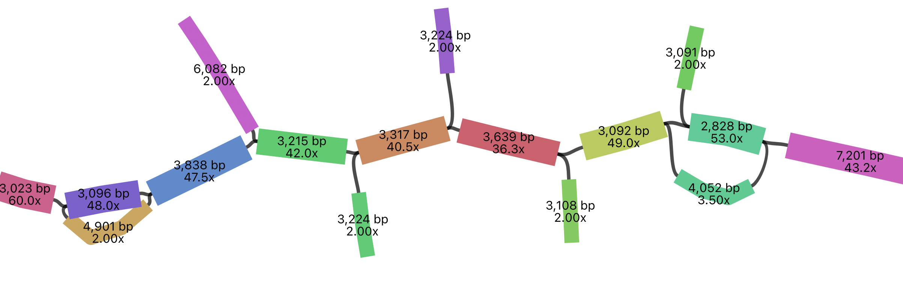

# lrSAGA Tutorial

Here, we show an example of assembling a *Caenorhabditis elegans* genome from PacBio HiFi sequencing of MDA amplified DNA isolated from half of an individual worm, generated by [Roberts et al. 2024](https://academic.oup.com/gbe/article/16/12/evae254/7909031).

BioProject - [PRJNA1063365](https://www.ncbi.nlm.nih.gov/bioproject/PRJNA1063365/)

SRA accession - [SRR27483171](https://www.ncbi.nlm.nih.gov/sra/SRR27483171)

---

### Optional. Download pre-prepared assembly graph

You can download a pre-prepared assembly graph (~ 92.8 MB) and **skip steps 1, 2, and 3 below**.

```
wget https://zenodo.org/records/20542930/files/mbg_k2001.gfa.gz
gunzip mbg_k2001.gfa.gz
```

---

### 1. Download PacBio HiFi reads

```
fasterq-dump SRR27483171
```

### 2. Construct an assembly graph using MBG

```
MBG -i SRR27483171.fastq -o mbg_k2001.gfa -k 2001 -t 6
```

`-i` specifies the input fastq.gz file with sequencing reads

`-o` specifices the output filename for the assembly graph in GFA format

`-k` specifies a k-mer size. The coverage/sequencing depth is good for this sample, so we use a k-mer size of 2001. If your sequencing depth is lower or if your reads have higher error rates, you should try smaller k-kmer sizes, e.g. `-k 1001` or `-k 701`

`-t` specifies the number of threads

### 3. Preprocess the GFA file

GFA files created by MBG have float values in the FC (Fragment count) field. This causes gfapy to throw an error if validation is performed when importing a graph (`--vlevel >=1`) as it expects integer values. The script `preprocess_mbg_gfa.py` edits the FC tags to replace "FC:f:" with "FC:i:".

```
python preprocess_mbg_gfa.py -i mbg_k2001.gfa -o mbg_k2001.tmp.gfa
mv mbg_k2001.tmp.gfa mbg_k2001.gfa
```

****
	
### 4. Determine lrSAGA parameters

lrSAGA exposes many parameters for assembly graph processing and simplification. The included script `gfa_stats.py` helps to decide parameters. It reports assembly coverage, length, and connectivity statistics.

```
python gfa_stats.py -i mbg_k2001.gfa
```


>```
>Importing GFA file: mbg_k2001.gfa
>Imported: mbg_k2001.gfa
>Summary
>-------------------------
>Nodes in graph: 83,227
>Nodes with FC: 83,227
>Nodes missing FC: 0
>Mean FC: 15.399x
>Median FC: 2.000x
>Stdev FC: 48.416x
>Min FC: 1.500x
>Q1 FC: 2.000x
>Q3 FC: 31.000x
>Max FC: 6615.000x
>Length-weighted mean FC: 16.030x
>Length-weighted median FC: 2.333x
>
>Coverage percentiles (FC tag)
>-----------------------------
>  p1: 2.000x
>  p5: 2.000x
>  p10: 2.000x
>  p25: 2.000x
>  p50: 2.000x
>  p75: 31.000x
>  p90: 47.000x
>  p95: 54.000x
>  p99: 67.000x
>
>Length percentiles and N-statistics
>-----------------------------------
>Percentiles:
>  p1: 2,703 bp
>  p5: 2,827 bp
>  p10: 2,884 bp
>  p25: 2,985 bp
>  p50: 3,229 bp
>  p75: 4,224 bp
>  p90: 5,760 bp
>  p95: 7,177 bp
>  p99: 12,851 bp
>N-statistics:
>  N10: 8,542 bp
>  N25: 5,359 bp
>  N50: 3,678 bp
>  N75: 3,047 bp
>  N90: 2,916 bp
>
>Connectivity summary
>--------------------
>11,866 nodes have 0 neighbours
>32,346 nodes have 1 neighbours
>14,312 nodes have 2 neighbours
>11,120 nodes have 3 neighbours
>8,668 nodes have 4 neighbours
>3,376 nodes have 5 neighbours
>...
>...
>...
>Coverage distribution (FC tag)
>-----------------------------
>   0.000 |  (0)
>   1.000 |  (19)
>   2.000 | ################################################## (47,890)
>   3.000 | ##### (4,813)
>   4.000 | # (1,242)
>   5.000 |  (312)
>   6.000 |  (192)
>   7.000 |  (165)
>   8.000 |  (150)
>   9.000 |  (123)
>  10.000 |  (160)
> ...
> ...
> ...
>```

Here you can see most of the nodes in the assembly are low coverage (2x) - these include things like tips and bubbles from sequencing errors and also MDA introduced chimeras.

We also recommend visualising the assembly graph using a tool like [Bandage](https://github.com/rrwick/Bandage):



Here, as expected, you can see low coverage tips and inverted chimeras interrupting the assembly graph.


### 5. Simplify the assembly graph with lrSAGA

You can choose to process the assembly graph in one step with aggressive parameters, e.g.:

```
python lrSAGA.py -i mbg_k2001.gfa -o mbg_k2001_lrSAGA.gfa --tip-len 20000 --tip-cov 10 --pop-bubbles --max-bubble-len 30000 --inverted-chimera-len 15000 --inverted-chimera-cov 40 --transitive-node-len 10000 --transitive-node-cov 10 --isolated-len 10000 --isolated-cov 5 --by-property-len 5000 --by-property-cov 5 --verbose
```

This example will iteratively remove nodes that are:

- tips <= 20,000 bp and <= 10x coverage (`--tip-len 20000 --tip-cov 10`)
- bubbles less than 30,000 bp (`--pop-bubbles --max-bubble-len 30000`)
- inverted chimeras <= 15,000 bp and <= 40x coverage (`--inverted-chimera-len 15000 --inverted-chimera-cov 40`)
- transitive nodes <= 10,000 bp and <= 10x coverage (`--transitive-node-len 10000 --transitive-node-cov 10`)
- isolated nodes <= 10,000 bp and 5x coverage (`--isolated-len 10000 --isolated-cov 5`)
- nodes <= 5,000 bp and <= 5x coverage (`--by-property-len 5000 --by-property-cov 5`)

lrSAGA will traverse through the assembly graph, removing nodes that meet these criteria, then merge linear paths, and repeat until no other changes are made:

<details>
<summary>Example lrSAGA Log</summary>

```
Starting lrSAGA
User provided arguments: ['lrSAGA.py', '-i', 'mbg_k2001.gfa', '-o', 'mbg_k2001_lrSAGA.gfa', '--tip-len', '20000', '--tip-cov', '10', '--pop-bubbles', '--max-bubble-len', '30000', '--inverted-chimera-len', '15000', '--inverted-chimera-cov', '40', '--transitive-node-len', '10000', '--transitive-node-cov', '10', '--isolated-len', '10000', '--isolated-cov', '5', '--by-property-len', '5000', '--by-property-cov', '5', '--verbose']
Parsed arguments: {'input': 'mbg_k2001.gfa', 'output': 'mbg_k2001_lrSAGA.gfa', 'verbose': True, 'save_intermediate': False, 'tip_len': 20000, 'tip_cov': 10.0, 'pop_bubbles': True, 'max_bubble_len': 30000, 'inverted_chimera_len': 15000, 'inverted_chimera_cov': 40.0, 'transitive_node_len': 10000, 'transitive_node_cov': 10.0, 'by_property_len': 5000, 'by_property_cov': 5.0, 'isolated_len': 10000, 'isolated_cov': 5.0, 'remove_list': None, 'vlevel': 0}

Importing GFA file: mbg_k2001.gfa
Imported: mbg_k2001.gfa
Writing verbose log to: mbg_k2001_lrSAGA.gfa.verbose.log

Nodes: 83,227; Edges: 88,494; Dead ends: 48,698; Total length: 331,743,665 bp; N50: 3,678 bp; Average node length: 3,986 bp; Median node length: 3,229 bp; Longest node: 49,203 bp; Shortest node: 2,001 bp;

ROUND 1
Identifying tips <= 20000 bp and <= 10.0x
32236 tips identified
Identifying inverted chimeras <= 15000 bp and <= 40.0x
3659 inverted chimeras identified
Identifying simple bubbles
11043 bubbles identified
Identifying nodes <= 5000 bp and <= 5.0x
48205 such nodes identified
Identifying isolated nodes <= 10000 bp and <= 5.0x
11845 isolated nodes identified
Identifying transitive nodes <= 10000 bp and <= 10.0x
7702 transitive nodes identified
Removing 54582 nodes

Nodes: 28,645; Edges: 28,694; Dead ends: 687; Total length: 130,840,835 bp; N50: 4,432 bp; Average node length: 4,568 bp; Median node length: 3,187 bp; Longest node: 49,203 bp; Shortest node: 2,001 bp;

Identifying linear paths to merge
Merged 500 linear paths including 28212 nodes

Nodes: 933; Edges: 982; Dead ends: 687; Total length: 100,882,004 bp; N50: 360,291 bp; Average node length: 108,126 bp; Median node length: 7,829 bp; Longest node: 1,795,106 bp; Shortest node: 2,001 bp;

ROUND 2
Identifying tips <= 20000 bp and <= 10.0x
118 tips identified
Identifying inverted chimeras <= 15000 bp and <= 40.0x
54 inverted chimeras identified
Identifying simple bubbles
126 bubbles identified
Identifying nodes <= 5000 bp and <= 5.0x
0 such nodes identified
Identifying isolated nodes <= 10000 bp and <= 5.0x
6 isolated nodes identified
Identifying transitive nodes <= 10000 bp and <= 10.0x
49 transitive nodes identified
Removing 263 nodes

Nodes: 670; Edges: 475; Dead ends: 603; Total length: 99,699,081 bp; N50: 363,055 bp; Average node length: 148,805 bp; Median node length: 56,616 bp; Longest node: 1,795,106 bp; Shortest node: 2,001 bp;

Identifying linear paths to merge
Merged 100 linear paths including 291 nodes

Nodes: 479; Edges: 284; Dead ends: 603; Total length: 99,521,608 bp; N50: 529,111 bp; Average node length: 207,770 bp; Median node length: 75,463 bp; Longest node: 1,882,178 bp; Shortest node: 2,001 bp;

ROUND 3
Identifying tips <= 20000 bp and <= 10.0x
2 tips identified
Identifying inverted chimeras <= 15000 bp and <= 40.0x
2 inverted chimeras identified
Identifying simple bubbles
18 bubbles identified
Identifying nodes <= 5000 bp and <= 5.0x
0 such nodes identified
Identifying isolated nodes <= 10000 bp and <= 5.0x
0 isolated nodes identified
Identifying transitive nodes <= 10000 bp and <= 10.0x
0 transitive nodes identified
Removing 20 nodes

Nodes: 459; Edges: 224; Dead ends: 601; Total length: 99,437,556 bp; N50: 529,111 bp; Average node length: 216,640 bp; Median node length: 84,131 bp; Longest node: 1,882,178 bp; Shortest node: 2,001 bp;

Identifying linear paths to merge
Merged 3 linear paths including 7 nodes

Nodes: 455; Edges: 220; Dead ends: 601; Total length: 99,432,242 bp; N50: 529,111 bp; Average node length: 218,532 bp; Median node length: 84,560 bp; Longest node: 1,882,178 bp; Shortest node: 2,001 bp;

ROUND 4
Identifying tips <= 20000 bp and <= 10.0x
1 tips identified
Identifying inverted chimeras <= 15000 bp and <= 40.0x
1 inverted chimeras identified
Identifying simple bubbles
6 bubbles identified
Identifying nodes <= 5000 bp and <= 5.0x
0 such nodes identified
Identifying isolated nodes <= 10000 bp and <= 5.0x
0 isolated nodes identified
Identifying transitive nodes <= 10000 bp and <= 10.0x
1 transitive nodes identified
Removing 6 nodes

Nodes: 449; Edges: 205; Dead ends: 601; Total length: 99,409,145 bp; N50: 541,720 bp; Average node length: 221,401 bp; Median node length: 90,827 bp; Longest node: 1,882,178 bp; Shortest node: 2,001 bp;

Identifying linear paths to merge
Merged 1 linear paths including 3 nodes

Nodes: 447; Edges: 203; Dead ends: 601; Total length: 99,406,859 bp; N50: 541,720 bp; Average node length: 222,387 bp; Median node length: 91,708 bp; Longest node: 1,882,178 bp; Shortest node: 2,001 bp;

ROUND 5
Identifying tips <= 20000 bp and <= 10.0x
3 tips identified
Identifying inverted chimeras <= 15000 bp and <= 40.0x
0 inverted chimeras identified
Identifying simple bubbles
0 bubbles identified
Identifying nodes <= 5000 bp and <= 5.0x
0 such nodes identified
Identifying isolated nodes <= 10000 bp and <= 5.0x
0 isolated nodes identified
Identifying transitive nodes <= 10000 bp and <= 10.0x
0 transitive nodes identified
Removing 3 nodes

Nodes: 444; Edges: 200; Dead ends: 598; Total length: 99,393,678 bp; N50: 541,720 bp; Average node length: 223,860 bp; Median node length: 97,735 bp; Longest node: 1,882,178 bp; Shortest node: 2,001 bp;

Identifying linear paths to merge
Merged 0 linear paths including 0 nodes

Nodes: 444; Edges: 200; Dead ends: 598; Total length: 99,393,678 bp; N50: 541,720 bp; Average node length: 223,860 bp; Median node length: 97,735 bp; Longest node: 1,882,178 bp; Shortest node: 2,001 bp;

ROUND 6
Identifying tips <= 20000 bp and <= 10.0x
0 tips identified
Identifying inverted chimeras <= 15000 bp and <= 40.0x
0 inverted chimeras identified
Identifying simple bubbles
0 bubbles identified
Identifying nodes <= 5000 bp and <= 5.0x
0 such nodes identified
Identifying isolated nodes <= 10000 bp and <= 5.0x
0 isolated nodes identified
Identifying transitive nodes <= 10000 bp and <= 10.0x
0 transitive nodes identified
Identified 0 nodes to remove. Exit.
Writing graph to file: mbg_k2001_lrSAGA.gfa
```
</details>

**However, we recommend processing the assembly in multiple steps**, starting with more conservative parameters. For example, start by removing tips, inverted chimeras, and isolated nodes that are short and low-coverage, and then applying more aggressive parameters. E.g.:

```
INPUT_GFA=mbg_k2001.gfa

python lrSAGA.py --verbose -i $INPUT_GFA -o "${INPUT_GFA%.gfa}_lrSAGA.r1.gfa" --tip-len 5000 --tip-cov 5 --isolated-len 4000 --isolated-cov 3 --inverted-chimera-len 5000 --inverted-chimera-cov 5

python lrSAGA.py --verbose -i "${INPUT_GFA%.gfa}_lrSAGA.r1.gfa" -o "${INPUT_GFA%.gfa}_lrSAGA.r2.gfa" --tip-len 10000 --tip-cov 10 --isolated-len 4000 --isolated-cov 3 --inverted-chimera-len 10000 --inverted-chimera-cov 10 --pop-bubbles --max-bubble-len 30000 --transitive-node-len 5000 --transitive-node-cov 5

python lrSAGA.py --verbose -i "${INPUT_GFA%.gfa}_lrSAGA.r2.gfa" -o "${INPUT_GFA%.gfa}_lrSAGA.r3.gfa" --tip-len 10000 --tip-cov 30 --isolated-len 10000 --isolated-cov 4 --inverted-chimera-len 30000 --inverted-chimera-cov 50 --pop-bubbles --max-bubble-len 30000 --transitive-node-len 30000 --transitive-node-cov 30 --by-property-len 5000 --by-property-cov 5
```

This should complete in a similar time (or quicker!) and can yield better assemblies. This is because MDA libraries have extemely uneven coverage depth. Aggressively discarding low-coverage contigs (too early in the graph simplification process) can led to gaps in the assembly graph.

### 6. Convert output GFA file to Fasta format

```
python gfa_to_fasta.py -i mbg_k2001_lrSAGA.gfa -o mbg_k2001_lrSAGA.fasta --rename
```

`-i` specifies the input GFA filename

`-o` specifies the output Fasta filename

`--rename` renames the sequence IDs (which can be very long). `{output}_names.tsv` can be used to track original and new names.
